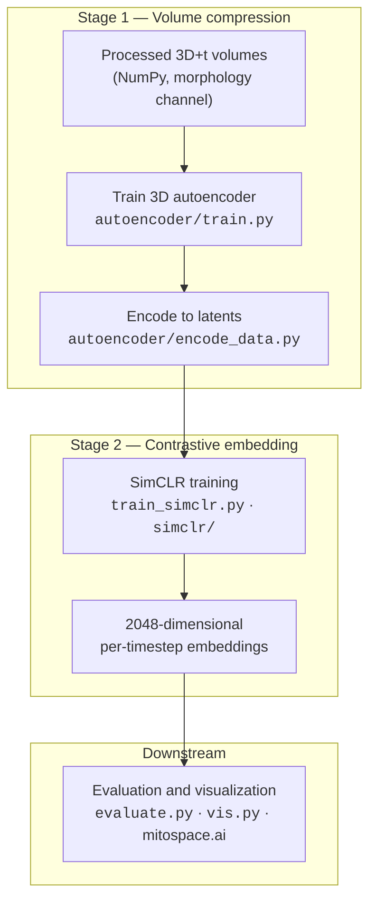

# MitoSpace4D

[](https://mitospace.ai)
[](https://www.python.org/downloads/)
[](https://lightning.ai/)
[](https://huggingface.co/schoeneberglab/mitospace)
[](./LICENSE)

Research codebase and training pipeline for **MitoSpace4D**: self-supervised 4D representations of mitochondrial morphology from volumetric live-cell microscopy (3D + time), trained with a 3D convolutional autoencoder followed by SimCLR-style contrastive learning. The public atlas is hosted at **[mitospace.ai](https://mitospace.ai)**.


## Table of contents

- [Architecture](#architecture)
- [Repository layout](#repository-layout)
- [Requirements](#requirements)
- [Installation](#installation)
- [Usage](#usage)
- [Configuration](#configuration)
- [Distributed training](#distributed-training)
- [Model weights](#model-weights)
- [Citation](#citation)
- [License](#license)
- [Support](#support)

## Architecture

Training is **two-stage** and **configuration-driven** (YAML): a 3D autoencoder compresses volumes, then a spatiotemporal encoder is trained with SimCLR (InfoNCE) on latent or processed stacks.



| Step | Component | Entry point | Configuration |
| --- | --- | --- | --- |
| 1 | 3D autoencoder | `autoencoder/train.py` | `autoencoder/config.yaml` |
| 2 | Latent encoding | `autoencoder/encode_data.py` | CLI flags |
| 3 | SimCLR / MitoSpace4D | `train_simclr.py` | `simclr/config.yaml` |
| 4 | Embedding generation and k-NN evaluation | `evaluate.py` | `simclr/config.yaml` |
| 5 | UMAP / 3D visualization | `vis.py` | `simclr/config.yaml` |
| — | Hub release (maintainers) | `utils/hf_checkpoint.py` | CLI flags; see script docstring |

## Repository layout

| Path | Role |
| --- | --- |
| `autoencoder/` | 3D autoencoder training and dataset encoding |
| `simclr/` | Contrastive training: model, losses, augmentations, Lightning runner |
| `data/` | Dataset classes and contrastive dataloaders |
| `data_aug/` | Augmentation helpers |
| `extraction_utils/` | Data extraction utilities and label maps |
| `metadata/` | Visualization metadata (labels, colors, frames) |
| `utils/` | Evaluation, reproducibility, Hugging Face release helpers |
| `adaptors/` | Optional downstream tasks (e.g. classifiers) |
| `interpretability/` | Analysis and correlation scripts |
| `application/` | Application-oriented utilities |
| `paper/` | Manuscript figure scripts |
| `train_simclr.py`, `evaluate.py`, `vis.py` | Top-level training and analysis entry points |
| `pyproject.toml` | Package metadata and dependencies |

## Requirements

- **Python** 3.11 or later (`pyproject.toml`).
- **CUDA** GPU for training and for inference with the released PyTorch module (the model attaches its augmentation pipeline on CUDA at initialization).

## Installation

```bash
git clone https://github.com/schoeneberglab/MitoSpace4D.git
cd MitoSpace4D
pip install -e .
```

Dependencies are declared in `pyproject.toml`. A legacy `environment.yml` may exist locally but is not the canonical dependency specification.

## Usage

### 1. Train the 3D autoencoder

Point `data.manifest_path` in `autoencoder/config.yaml` at your processed `.npy` volumes, then:

**Download the public manifest**

- **S3**: `s3://mitospace4d/processed_data/manifest.parquet`

```bash
aws s3 cp s3://mitospace4d/processed_data/manifest.parquet manifest.parquet
```

The manifest is a Parquet table of sample metadata/paths used to index processed volumes.

```bash
cd autoencoder
python train.py --config config.yaml
python train.py --config config.yaml --resume runs/<run_name>/latest.pt   # optional resume
```

Training logs to **Weights & Biases** (`wandb_project` in config). Set `WANDB_API_KEY` in the environment.

### 2. Encode volumes to latents

```bash
python autoencoder/encode_data.py \
    --checkpoint autoencoder/runs/<run_name>/latest.pt \
    --data_root  /path/to/processed_data/ \
    --pattern    "2024*/*-0-1.npy"
```

Encoded arrays are written under `<data_root>/../encoded_data/`, preserving relative paths.

### 3. Train MitoSpace4D (SimCLR)

Set `data_params.data_path` in `simclr/config.yaml` to encoded (or processed) data and adjust `distributed` for your cluster. Then:

```bash
python -m train_simclr --config simclr/config.yaml
```

Checkpoints and TensorBoard logs follow `logging_params.save_path` in the same YAML file.

### 4. Generate embeddings and evaluate

```bash
python evaluate.py \
    --config          simclr/config.yaml \
    --checkpoint_path /path/to/checkpoint.ckpt \
    --data_path       /path/to/dataset \
    --evaluate_set    test \
    --dist_metric     cosine
```

The script writes embedding arrays and runs k-nearest-neighbor evaluation (e.g. Top-1 / Top-3). Some paths in `evaluate.py` may still default to lab-specific locations; override via CLI arguments where supported.

### 5. Visualize embeddings

```bash
python vis.py --config simclr/config.yaml --checkpoint_path /path/to/checkpoint.ckpt
```

Supports UMAP projections and optional Open3D visualization, consistent with the mitospace.ai workflow.

## Configuration

| File | Contents |
| --- | --- |
| `autoencoder/config.yaml` | Data manifest, splits, batching, W&B logging, training schedule |
| `simclr/config.yaml` | Data roots, time and Z extent, augmentations, backbone and loss, distributed settings |

Minimum fields to review before a run:

| Key | Purpose |
| --- | --- |
| `data_params.data_path` | Root directory for training volumes |
| `logging_params.save_path` | Checkpoint and TensorBoard output directory |
| `distributed.num_nodes`, `distributed.num_gpus`, `distributed.strategy` | Multi-node / multi-GPU layout |
| `training.batch_size`, `training.lr`, `training.max_epochs` | Optimization |

## Distributed training

`train_simclr.py` configures PyTorch Lightning from `simclr/config.yaml` (default strategy `ddp`). For SLURM, submit a job that invokes `python -m train_simclr --config simclr/config.yaml` and align `--gres=gpu:<n>` and task counts with `distributed.num_gpus` and `distributed.num_nodes`.

The reference public checkpoint was trained at **SDSC** on 15 nodes × 4 NVIDIA V100 GPUs (effective batch 120), 300 epochs, on the order of three days wall time.

## Model weights

Public weights and model card live on Hugging Face: **[schoeneberglab/mitospace](https://huggingface.co/schoeneberglab/mitospace)** (private during review; token with read access required).

**Download the manifest (processed data index)**

```bash
export HF_TOKEN=<read_token>
python utils/hf_checkpoint.py download --filename processed_data/manifest.parquet
```

**Download weights**

```bash
export HF_TOKEN=<read_token>
python utils/hf_checkpoint.py download --filename model.safetensors
```

**Maintainers — publish a release bundle**

```bash
export HF_TOKEN=<write_token>
python utils/hf_checkpoint.py release --ckpt /path/to/ms4d.ckpt
```

**Maintainers — upload the manifest**

```bash
export HF_TOKEN=<write_token>
python utils/hf_checkpoint.py upload \
  --ckpt /path/to/manifest.parquet \
  --path-in-repo processed_data/manifest.parquet
```

This builds `model.safetensors`, `config.json`, copies `LICENSE`, stages the Hub `README.md`, and can run a CUDA sanity check before upload. If `MODEL_CARD.md` is not present in the clone (it is gitignored), the tool pulls `README.md` from the same Hub repository; override with `--model-card /path/to/README.md` when needed. Full options are documented in `utils/hf_checkpoint.py`.

## Citation

If you use this software or the associated model, please cite the manuscript when it is available (currently under review at *Cell*). A BibTeX entry will be added here after publication.

## License

Use of this repository and of the linked model weights is governed by the **[Review License](./LICENSE)** in this repository: materials are provided for evaluation of the associated *Cell* submission; uses outside those terms are not permitted until re-release after publication. Copyright © 2026 The Regents of the University of California.

## Support

Bug reports and feature requests: **[open an issue](https://github.com/schoeneberglab/MitoSpace4D/issues)**. Lab contact: **[Schoeneberg Lab](https://github.com/schoeneberglab)** on GitHub.
