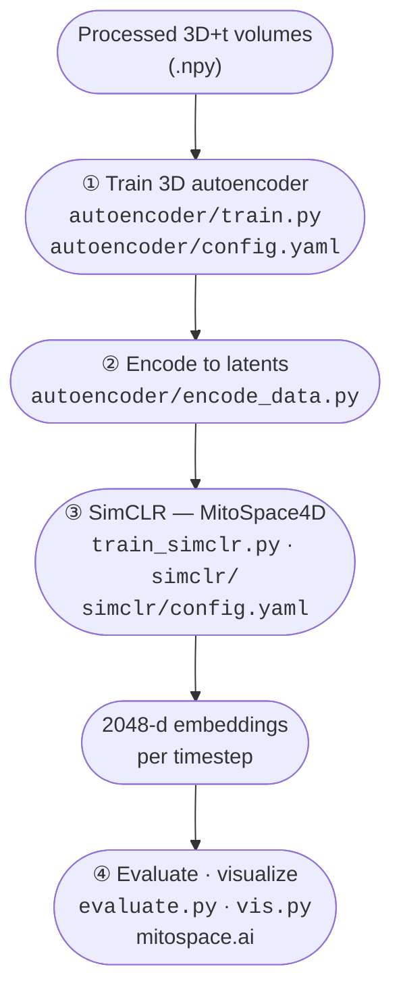

# MitoSpace

[](https://mitospace.ai)
[](https://www.python.org/)
[](https://lightning.ai/)
[](https://huggingface.co/schoeneberglab/mitospace)
[](./LICENSE)

**MitoSpace** is a 4D self-supervised model that learns continuous representations of mitochondrial morphology across **space (3D), time, and treatment**. It is trained on volumetric live-cell microscopy with a contrastive (SimCLR) objective on top of a 3D convolutional autoencoder, and powers the interactive atlas at **[mitospace.ai](https://mitospace.ai)**.


---

## Pipeline overview

Training is a **two-stage** pipeline (autoencoder → SimCLR). Both stages are config-driven (YAML); paths and hyperparameters are not hard-coded.



| Stage | Entry point | Config |
| --- | --- | --- |
| 1. 3D autoencoder pre-training | `autoencoder/train.py` | `autoencoder/config.yaml` |
| 1b. Encode dataset to latents  | `autoencoder/encode_data.py` | — (CLI flags) |
| 2. SimCLR contrastive training | `train_simclr.py` | `simclr/config.yaml` |
| 3. Embedding generation + k-NN evaluation | `evaluate.py` | `simclr/config.yaml` |
| 3b. UMAP / 3D visualization | `vis.py` | `simclr/config.yaml` |
| Release model to Hugging Face | `utils/hf_checkpoint.py` | — (CLI flags) |

---

## Repository layout

```
.
├── autoencoder/                3D conv autoencoder (pre-training + dataset encoding)
├── simclr/                     SimCLR runner, 4D backbone (3D-ResNet + BiLSTM), augmentations, losses
├── data/                       Dataset classes and contrastive dataloaders
├── data_aug/                   Augmentation helpers
├── extraction_utils/           Raw data extraction, drug → label mapping
├── metadata/                   Drug labels, colors, frames for visualization
├── utils/                      Evaluation, regression, HF release tooling, helpers
├── adaptors/                   Downstream adaptors (cancer / drug classifiers, etc.)
├── interpretability/           4D feature analysis, MitoTNT correlation
├── application/                Application-side scripts (embedding generation, batch correction)
├── paper/                      Scripts used to produce manuscript figures
├── train_simclr.py             Stage-2 training entry point
├── evaluate.py                 Embedding generation + nearest-neighbor evaluation
├── vis.py                      UMAP / Open3D visualization
└── pyproject.toml              Dependencies (Python ≥ 3.11)
```

---

## Installation

**Requirements**: Python ≥ 3.11, CUDA-capable GPU (training and inference both require CUDA — the SimCLR model moves its augmentation pipeline to CUDA at construction time).

```bash
git clone https://github.com/schoeneberglab/MitoSpace4D.git
cd MitoSpace4D
pip install -e .
```

This installs all dependencies declared in `pyproject.toml` (PyTorch, Lightning, Kornia, Open3D, scikit-image, UMAP, Hugging Face Hub, safetensors, etc.).

> **Note.** A legacy `environment.yml` is included for reference, but `pyproject.toml` is the source of truth.

---

## Quick start

### 1. Pre-train the 3D autoencoder

Edit `autoencoder/config.yaml` to point `data.manifest_path` at your processed `.npy` volumes, then:

```bash
cd autoencoder
python train.py --config config.yaml
# resume from a checkpoint:
python train.py --config config.yaml --resume runs/<run_name>/latest.pt
```

Logging is to Weights & Biases (project: `mitospace-ae`); set `WANDB_API_KEY` in your environment.

### 2. Encode the dataset

Project raw volumes through the trained encoder once to produce compact latents that Stage 2 trains on:

```bash
python autoencoder/encode_data.py \
    --checkpoint autoencoder/runs/<run_name>/latest.pt \
    --data_root  /path/to/processed_data/ \
    --pattern    "2024*/*-0-1.npy"
```

Outputs are written to `<data_root>/../encoded_data/` mirroring the input directory tree.

### 3. Train MitoSpace (SimCLR stage)

Configure paths and hyperparameters in `simclr/config.yaml` — in particular `data_params.data_path` (point at the encoded data from step 2) and the `distributed` block (number of nodes / GPUs).

```bash
python -m train_simclr --config simclr/config.yaml
```

Checkpoints and TensorBoard logs are written under `logging_params.save_path`.

### 4. Generate embeddings and evaluate

```bash
python evaluate.py \
    --config          simclr/config.yaml \
    --checkpoint_path /path/to/ms4d.ckpt \
    --data_path       /path/to/dataset \
    --evaluate_set    test \
    --dist_metric     cosine
```

This writes `embeddings.npy`, `labels.npy`, and a confusion matrix to the directory configured in `evaluate.py`, then runs a weighted k-NN classifier reporting Top-1 / Top-3 per-class accuracy.

### 5. Visualize the embedding space

```bash
python vis.py --config simclr/config.yaml --checkpoint_path /path/to/ms4d.ckpt
```

Renders UMAP projections and (optionally) an interactive Open3D point cloud — the same view that backs the [mitospace.ai](https://mitospace.ai) atlas.

---

## Configuration

All training behaviour lives in two YAML files:

- **`autoencoder/config.yaml`** — input shape, latent dim, batch / grad-accum, W&B project.
- **`simclr/config.yaml`** — data root, timesteps × z-stacks, augmentation pipeline, model arch (ResNet-3D + BiLSTM), loss (InfoNCE / SupCon), distributed strategy.

Before launching a run, update at minimum:

| Key | What it controls |
| --- | --- |
| `data_params.data_path` | Path to encoded (or processed) volumes |
| `logging_params.save_path` | Where checkpoints & TB logs go |
| `distributed.num_nodes`, `distributed.num_gpus` | Multi-node / multi-GPU setup |
| `training.batch_size`, `training.lr`, `training.max_epochs` | Optimization |

---

## Multi-GPU / SLURM training

The Lightning trainer in `train_simclr.py` reads `distributed.num_nodes`, `distributed.num_gpus`, and `distributed.strategy` directly from `simclr/config.yaml` (default `ddp`). To launch on a SLURM cluster, wrap `python -m train_simclr --config simclr/config.yaml` in a sbatch script and make sure `--ntasks-per-node` and `--gres=gpu:<n>` match `num_gpus`.

The released checkpoint was trained on the **SDSC** cluster: 15 × 4 V100 GPUs (effective batch = 120), 300 epochs, ≈ 3 days wall-clock.

---

## Pretrained weights (Hugging Face)

Pretrained weights are published to **[schoeneberglab/mitospace](https://huggingface.co/schoeneberglab/mitospace)**.

Download:

```bash
export HF_TOKEN=<token-with-read-access>
python utils/hf_checkpoint.py download --filename model.safetensors
```

Maintainers can build and publish a fresh release bundle (safetensors + `config.json` + `LICENSE` + Hub `README.md`, with a CUDA forward-pass sanity check) via:

```bash
export HF_TOKEN=<write-scoped token>
python utils/hf_checkpoint.py release --ckpt path/to/ms4d.ckpt
```

If `MODEL_CARD.md` is absent (default), the script reuses `README.md` from the same Hub repo (`HF_TOKEN` required for private repos). Override with `--model-card /path/to/card.md` if needed.

See the docstring at the top of `utils/hf_checkpoint.py` for the full CLI.

---

## Citation

If you use MitoSpace4D in your research, please cite the associated manuscript (currently under review at *Cell*). A BibTeX entry will be added here on publication.

---

## License

This project is released under the terms in [`LICENSE`](./LICENSE). The current license is a **Review License**: the code and model weights are made available for the purpose of evaluating the associated manuscript submitted to *Cell*, and may be downloaded, run, and inspected for review purposes only. Other use, redistribution, modification, or derivative works are not permitted under this license. On publication, the materials will be re-released under terms supporting academic citation and research use.

Copyright © 2026 The Regents of the University of California. All rights reserved.

---

## Contact

For questions about the model, dataset, or atlas, please open an issue on this repository or contact the [Schoeneberg Lab](https://github.com/schoeneberglab).
