# MitoSpace2D (2D) — embedding probe findings

Diagnostics aligned with [what-does-openphenom-learn](https://github.com/drv-agwl/what-does-openphenom-learn).

## Headline metrics

- **Participation ratio:** 19.52 / 512
- **Top-1 PC variance share:** 0.1387
- **Mean pairwise cosine similarity:** 0.2161

- **Raw gap / mAP:** 0.2386 / 0.2656
- **PCA-CenterScale gap / mAP:** 0.1254 / 0.2319

- **MitoSpace2D (2D):** Cohen's d=1.185, AUROC=0.7876, gap=0.2114

- **MitoTNT unusualness vs embedding gap (Spearman):** 0.3023 (p=0.1419)

## Full metrics

### E1_geometry

```json
{
  "n_cells_used": 20000,
  "embedding_dim": 512,
  "effective_rank_participation_ratio": 19.51718945673548,
  "components_for_90pct_variance": 32,
  "components_for_99pct_variance": 59,
  "top1_eigenvalue_share": 0.13874735114251804,
  "top10_eigenvalue_share": 0.5859738115894622,
  "pairwise_sim_mean": 0.21612800657749176,
  "pairwise_sim_std": 0.18338803946971893,
  "pairwise_sim_p05": -0.049261100590229034,
  "pairwise_sim_p95": 0.5491060018539429
}
```

### E4_discriminability

```json
{
  "n_classes": 25,
  "replicates_per_class": 20,
  "raw_gap": 0.238636776804924,
  "raw_map": 0.2655945064965346,
  "post_pca_centerscale_gap": 0.12538559921085835,
  "post_pca_centerscale_map": 0.23190917225227212,
  "random_floor_map": 0.048934436261953464
}
```

### E6_pca_viz

```json
{
  "n_cells": 5000,
  "pc1_var": 0.13834097981452942,
  "pc2_var": 0.10302462428808212
}
```

### E8_treatment_viz

```json
{
  "n_drugs": 25,
  "mean_off_diagonal_sim": 0.4960763156414032
}
```

### E9_constancy

```json
{
  "per_dim_std_mean": 0.038347408175468445,
  "per_dim_std_max": 0.07480184733867645,
  "l2_norm_mean": 1.0,
  "l2_norm_std": 3.8295695503620664e-08
}
```

### E10_cossim_by_condition

```json
{
  "n_cells": 12000,
  "n_drugs": 25,
  "effect_sizes": {
    "MitoSpace2D (2D)": {
      "gap": 0.211436465382576,
      "cohen_d": 1.1846409603722388,
      "auc": 0.7875815827416475
    }
  }
}
```

### E11_phenotype_vs_gap

```json
{
  "spearman_mitotnt_unusualness_vs_gap": 0.30230769230769233,
  "p_value": 0.14189407251612246,
  "top_drugs_by_gap": [
    "antimycina",
    "valinomycin",
    "cytochalasind",
    "cccp",
    "tbhp",
    "lantrunculinb"
  ],
  "bottom_drugs_by_gap": [
    "paraquat",
    "mfi8",
    "tiron",
    "mitomycinc",
    "p110",
    "dnp"
  ]
}
```

## Figures

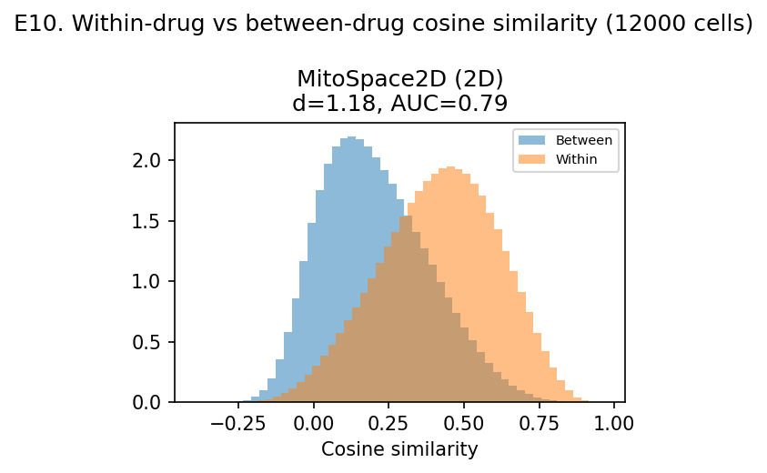

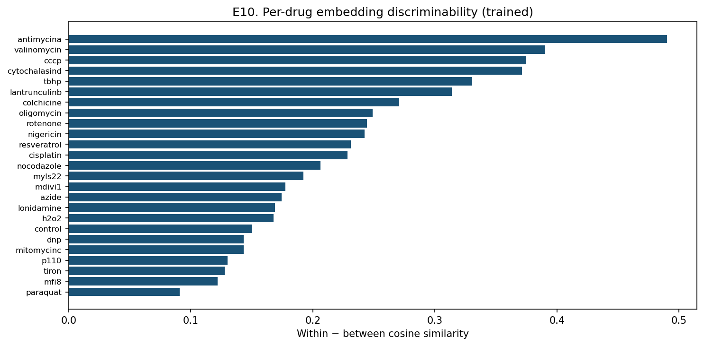

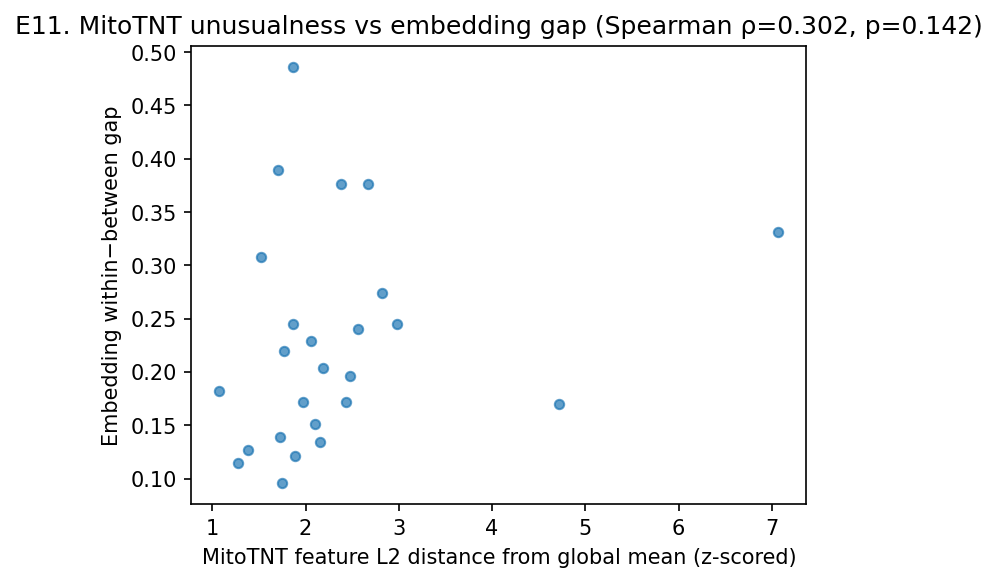

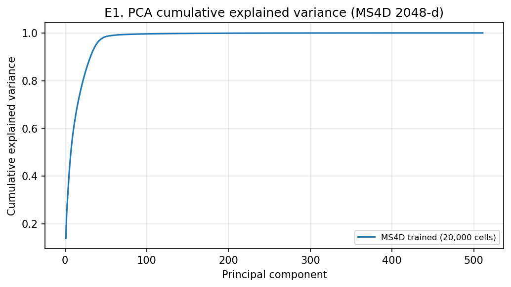

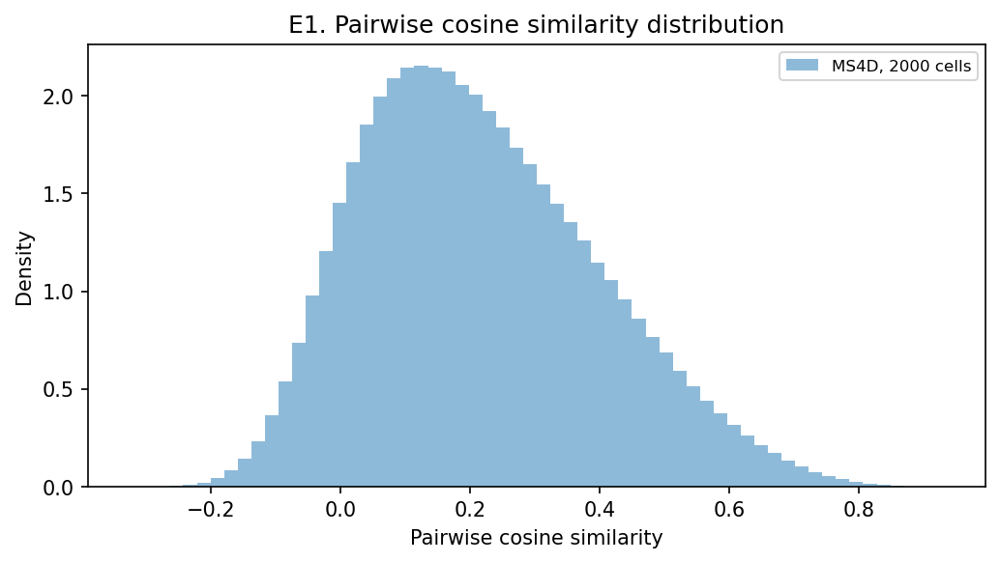

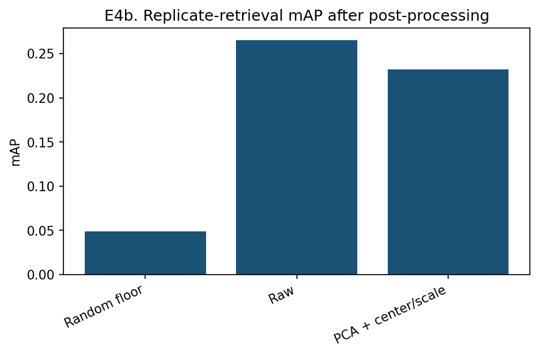

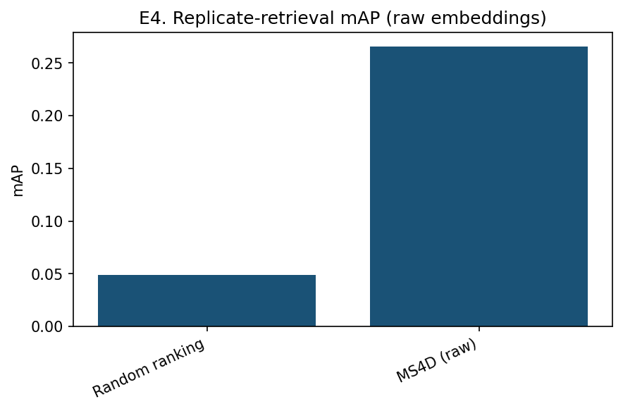

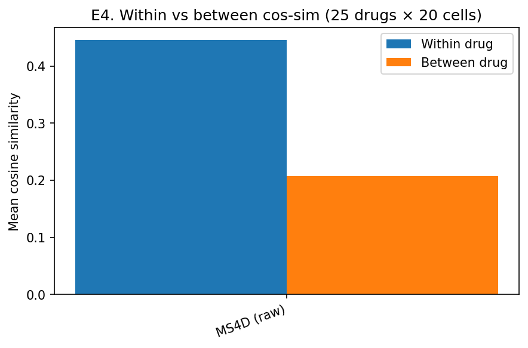

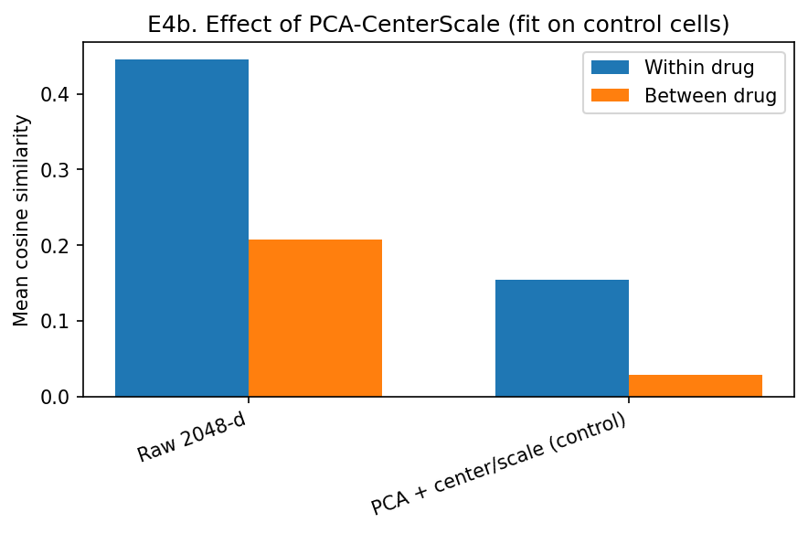

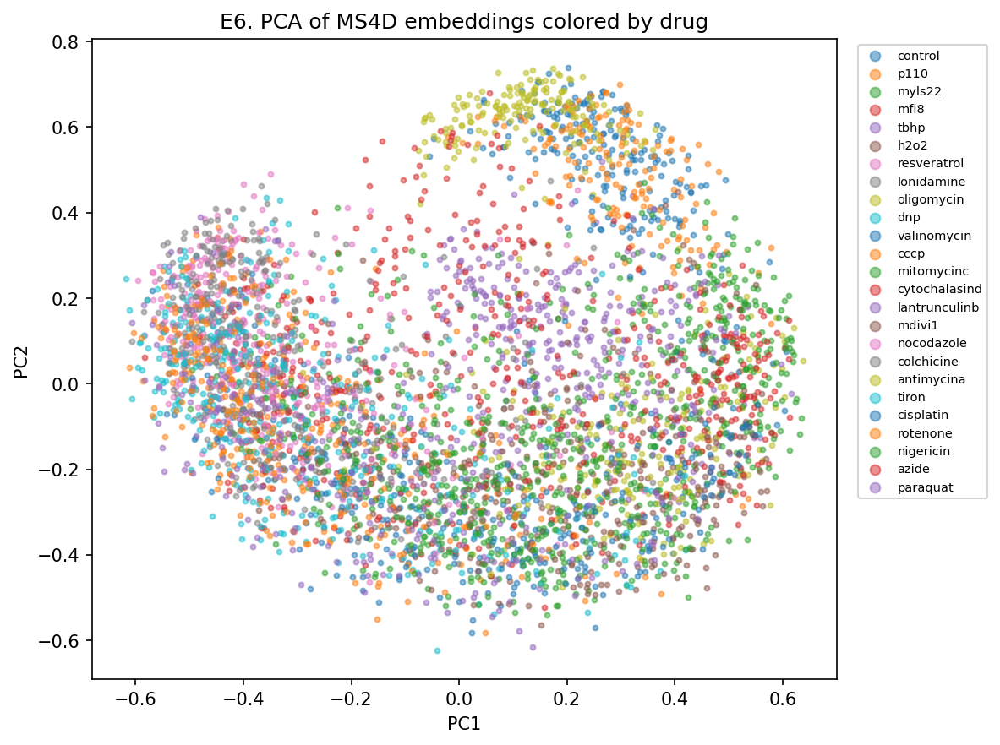

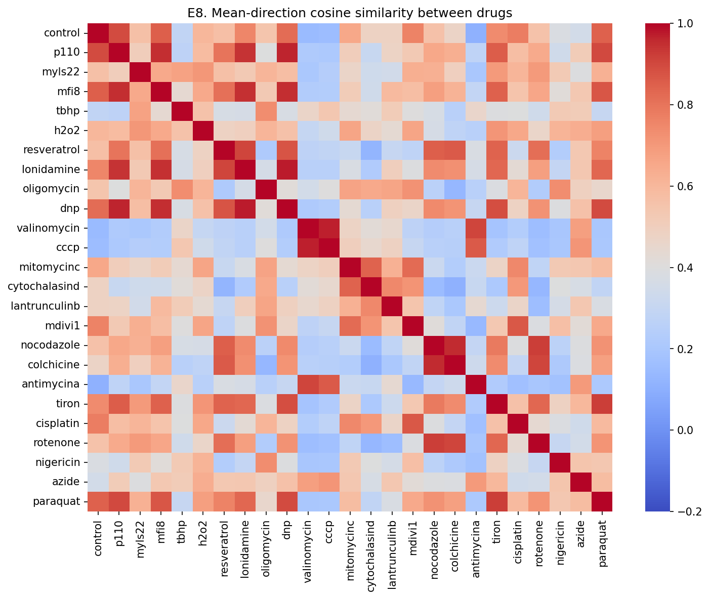

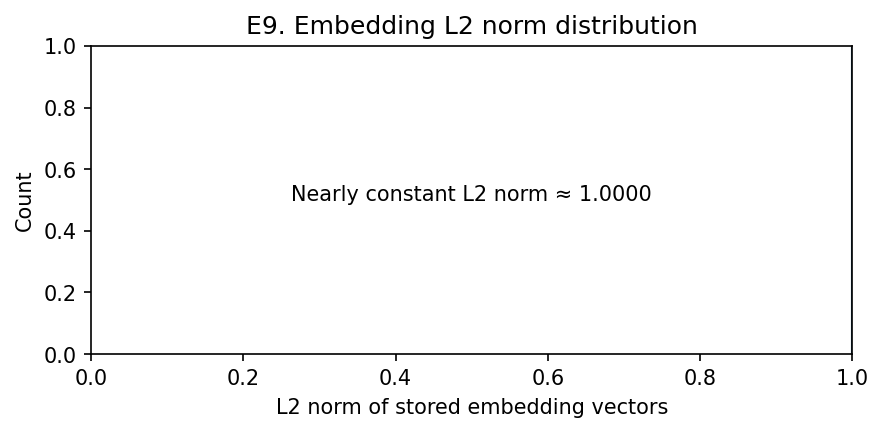

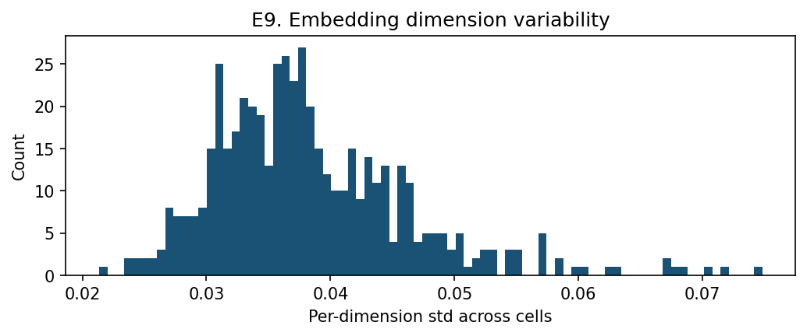
