# MitoSpace3D (3D) — embedding probe findings

Diagnostics aligned with [what-does-openphenom-learn](https://github.com/drv-agwl/what-does-openphenom-learn).

## Headline metrics

- **Participation ratio:** 14.69 / 2048
- **Top-1 PC variance share:** 0.153
- **Mean pairwise cosine similarity:** 0.2204

- **Raw gap / mAP:** 0.2869 / 0.2926
- **PCA-CenterScale gap / mAP:** 0.1606 / 0.3096

- **MitoSpace3D (3D):** Cohen's d=1.3, AUROC=0.8045, gap=0.2672

- **MitoTNT unusualness vs embedding gap (Spearman):** 0.2523 (p=0.2237)

## Full metrics

### E1_geometry

```json
{
  "n_cells_used": 20000,
  "embedding_dim": 2048,
  "effective_rank_participation_ratio": 14.692836439921775,
  "components_for_90pct_variance": 19,
  "components_for_99pct_variance": 45,
  "top1_eigenvalue_share": 0.15297762807056212,
  "top10_eigenvalue_share": 0.7109489743575196,
  "pairwise_sim_mean": 0.22039097547531128,
  "pairwise_sim_std": 0.21243567764759064,
  "pairwise_sim_p05": -0.0866197720170021,
  "pairwise_sim_p95": 0.6144115328788757
}
```

### E4_discriminability

```json
{
  "n_classes": 25,
  "replicates_per_class": 20,
  "raw_gap": 0.28689219057559967,
  "raw_map": 0.2925622755886967,
  "post_pca_centerscale_gap": 0.16057579219341278,
  "post_pca_centerscale_map": 0.3096232618582741,
  "random_floor_map": 0.048934436261953464
}
```

### E6_pca_viz

```json
{
  "n_cells": 5000,
  "pc1_var": 0.14965304732322693,
  "pc2_var": 0.1108146607875824
}
```

### E8_treatment_viz

```json
{
  "n_drugs": 25,
  "mean_off_diagonal_sim": 0.4359021484851837
}
```

### E9_constancy

```json
{
  "per_dim_std_mean": 0.018935123458504677,
  "per_dim_std_max": 0.04685678705573082,
  "l2_norm_mean": 1.0,
  "l2_norm_std": 3.750832888727018e-08
}
```

### E10_cossim_by_condition

```json
{
  "n_cells": 12000,
  "n_drugs": 25,
  "effect_sizes": {
    "MitoSpace3D (3D)": {
      "gap": 0.26716896891593933,
      "cohen_d": 1.2996013867996281,
      "auc": 0.8045204259393562
    }
  }
}
```

### E11_phenotype_vs_gap

```json
{
  "spearman_mitotnt_unusualness_vs_gap": 0.25230769230769234,
  "p_value": 0.2236964419557054,
  "top_drugs_by_gap": [
    "antimycina",
    "tbhp",
    "lantrunculinb",
    "cytochalasind",
    "azide",
    "cccp"
  ],
  "bottom_drugs_by_gap": [
    "mitomycinc",
    "mfi8",
    "dnp",
    "tiron",
    "p110",
    "lonidamine"
  ]
}
```

## Figures

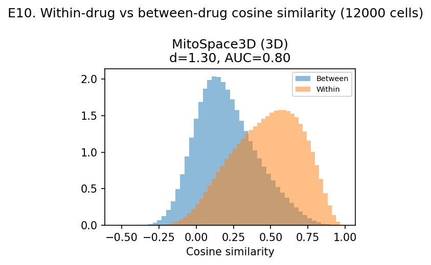

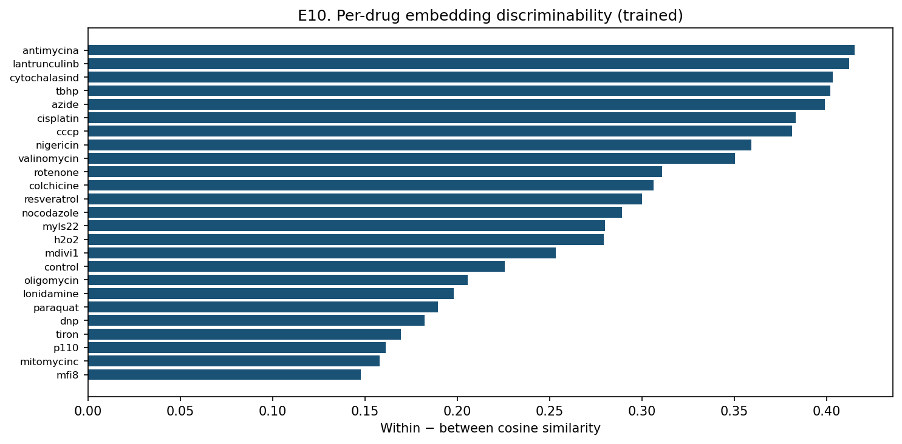

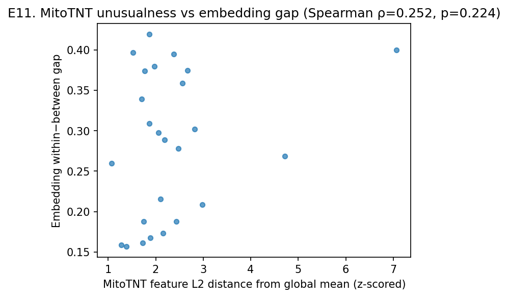

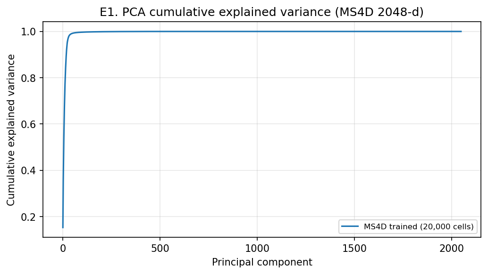

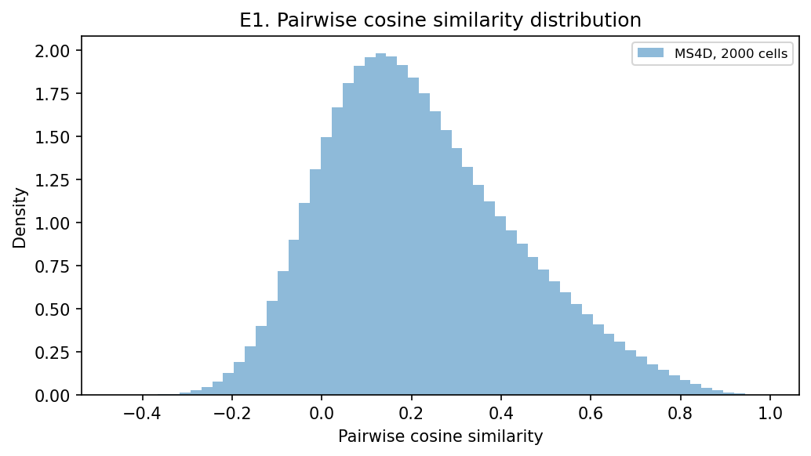

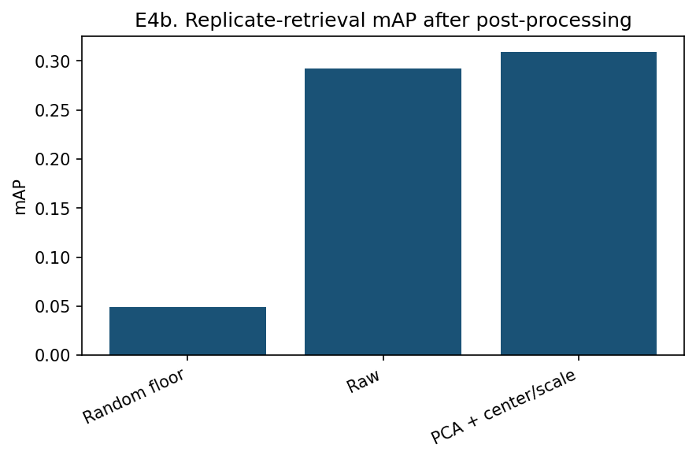

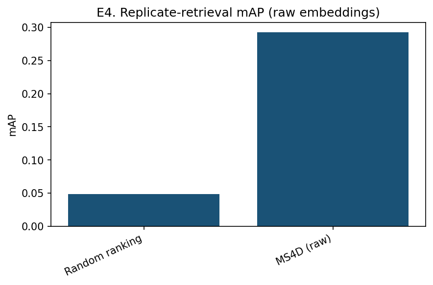

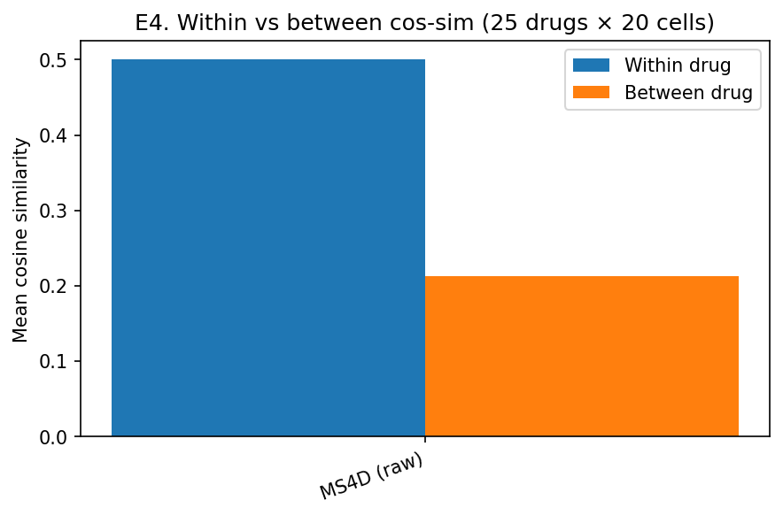

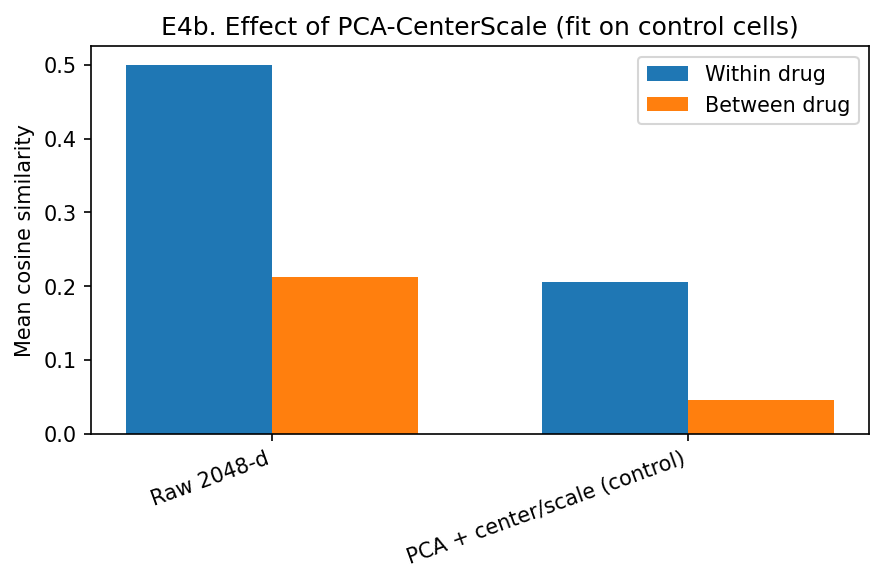

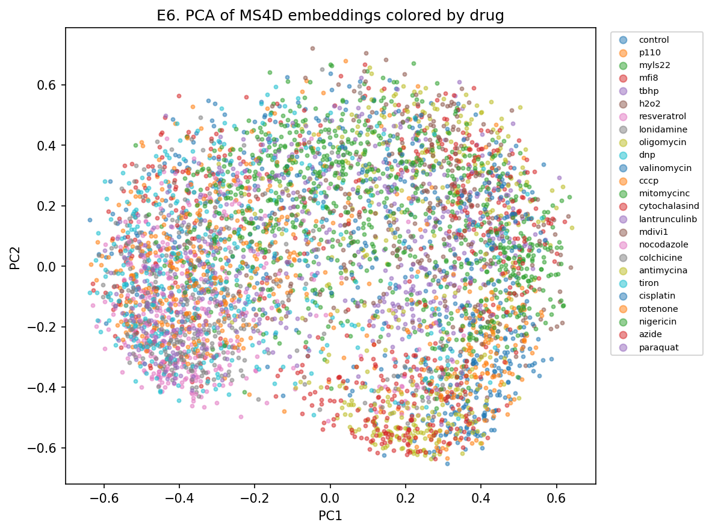

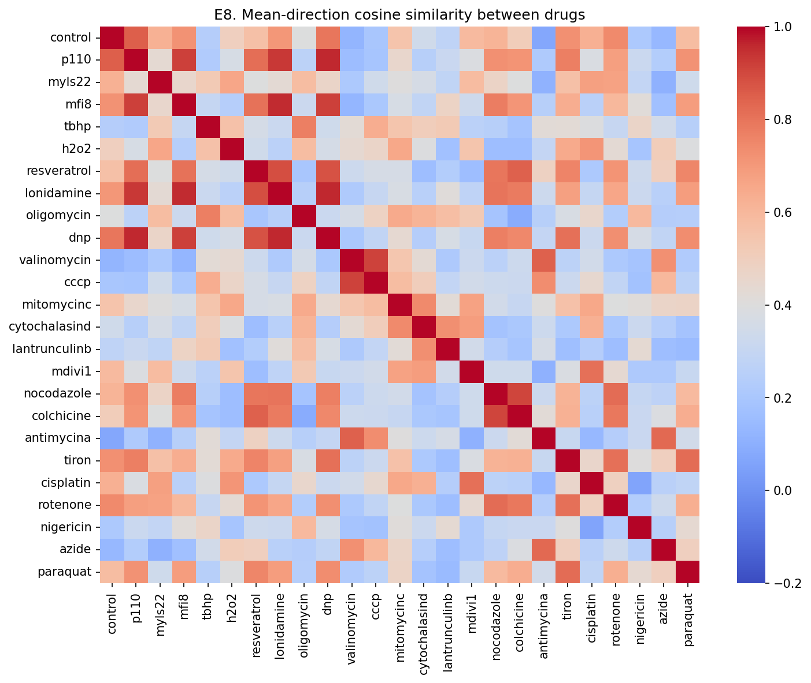


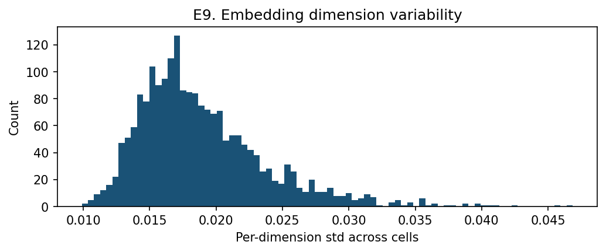
