# MitoSpace4D (4D) — embedding probe findings

Diagnostics aligned with [what-does-openphenom-learn](https://github.com/drv-agwl/what-does-openphenom-learn).

## Headline metrics

- **Participation ratio:** 16 / 2048
- **Top-1 PC variance share:** 0.1291
- **Mean pairwise cosine similarity:** 0.2344

- **Trained vs random-init Spearman ρ:** 0.005944
- **Within−between gap (trained / random):** 0.2653 / 1.192e-07
- **Replicate mAP (trained / random / floor):** 0.3008 / 0.04557 / 0.0437

- **Raw gap / mAP:** 0.2755 / 0.2957
- **PCA-CenterScale gap / mAP:** 0.2096 / 0.3263

- **MitoSpace4D (4D):** Cohen's d=1.267, AUROC=0.8096, gap=0.2649
- **Random-init (same arch.):** Cohen's d=0, AUROC=0.5081, gap=0

- **MitoTNT unusualness vs embedding gap (Spearman):** 0.5392 (p=0.005409)

## Full metrics

### E1_geometry

```json
{
  "n_cells_used": 20000,
  "embedding_dim": 2048,
  "effective_rank_participation_ratio": 15.99962358212486,
  "components_for_90pct_variance": 18,
  "components_for_99pct_variance": 28,
  "top1_eigenvalue_share": 0.1291120802864915,
  "top10_eigenvalue_share": 0.6964225541779684,
  "pairwise_sim_mean": 0.23441758751869202,
  "pairwise_sim_std": 0.2152668535709381,
  "pairwise_sim_p05": -0.1053793728351593,
  "pairwise_sim_p95": 0.6069359183311462
}
```

### E2_trained_vs_random

```json
{
  "n_cells": 8000,
  "n_drugs": 25,
  "spearman_pairwise_sim_rankings": 0.005943540515984588,
  "trained_gap": 0.2653385400772095,
  "random_gap": 1.1920928955078125e-07,
  "trained_replicate_map": 0.30079888535347354,
  "random_replicate_map": 0.04557330669648584,
  "random_ranking_floor_map": 0.04369727818187979,
  "trained_participation_ratio": 16.04647905687438,
  "random_participation_ratio": 1.5799631547383752,
  "map_lift_trained_over_random": 5.600330481980763
}
```

### E4_discriminability

```json
{
  "n_classes": 25,
  "replicates_per_class": 20,
  "raw_gap": 0.2755013704299927,
  "raw_map": 0.2957278902421908,
  "post_pca_centerscale_gap": 0.20962453819811344,
  "post_pca_centerscale_map": 0.3262598817650442,
  "random_floor_map": 0.048934436261953464
}
```

### E6_pca_viz

```json
{
  "n_cells": 5000,
  "pc1_var": 0.1256866306066513,
  "pc2_var": 0.09745773673057556
}
```

### E7_baseline

```json
{
  "spearman_trained_vs_random": 0.004386729747907692,
  "map_trained": 0.29741690281071376,
  "map_random": 0.045494404299346494,
  "map_floor": 0.043715782497977584
}
```

### E8_treatment_viz

```json
{
  "n_drugs": 25,
  "mean_off_diagonal_sim": 0.44289684295654297
}
```

### E9_constancy

```json
{
  "per_dim_std_mean": 0.019107507541775703,
  "per_dim_std_max": 0.03757963702082634,
  "l2_norm_mean": 1.0,
  "l2_norm_std": 3.999289432954356e-08
}
```

### E10_cossim_by_condition

```json
{
  "n_cells": 12000,
  "n_drugs": 25,
  "effect_sizes": {
    "MitoSpace4D (4D)": {
      "gap": 0.2649206966161728,
      "cohen_d": 1.2670093529143593,
      "auc": 0.80964384159039
    },
    "Random-init (same arch.)": {
      "gap": 0.0,
      "cohen_d": 0.0,
      "auc": 0.5081047579355961
    }
  }
}
```

### E11_phenotype_vs_gap

```json
{
  "spearman_mitotnt_unusualness_vs_gap": 0.5392307692307693,
  "p_value": 0.0054093036448047815,
  "top_drugs_by_gap": [
    "cytochalasind",
    "tbhp",
    "antimycina",
    "myls22",
    "nigericin",
    "cisplatin"
  ],
  "bottom_drugs_by_gap": [
    "mfi8",
    "dnp",
    "lonidamine",
    "p110",
    "paraquat",
    "mitomycinc"
  ]
}
```

## Figures

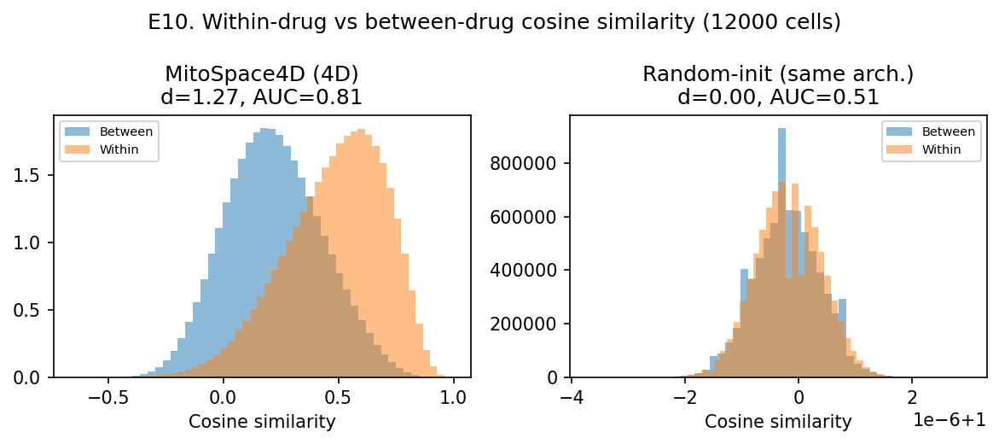

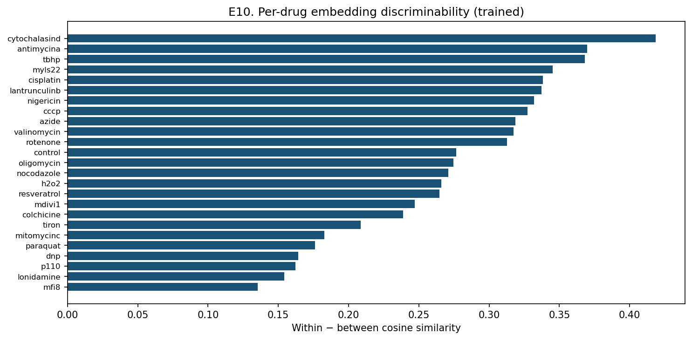

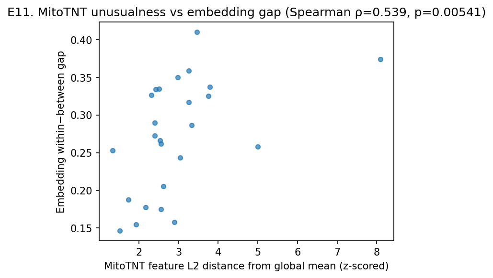

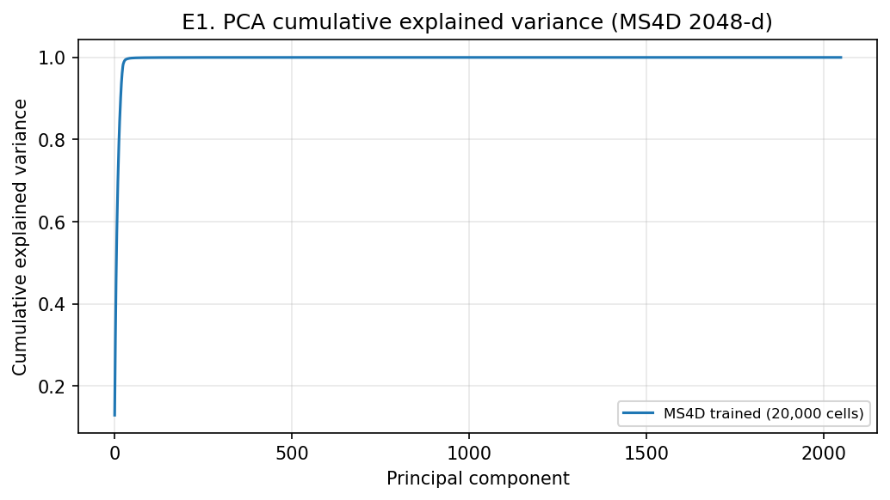

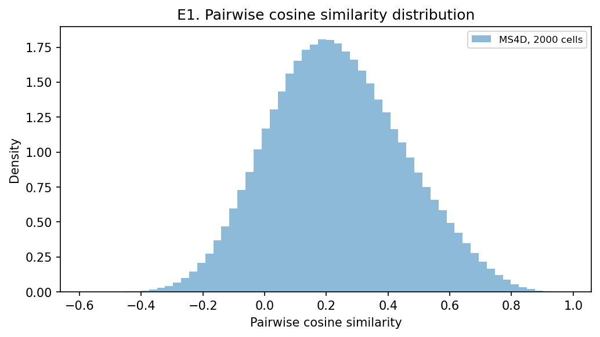

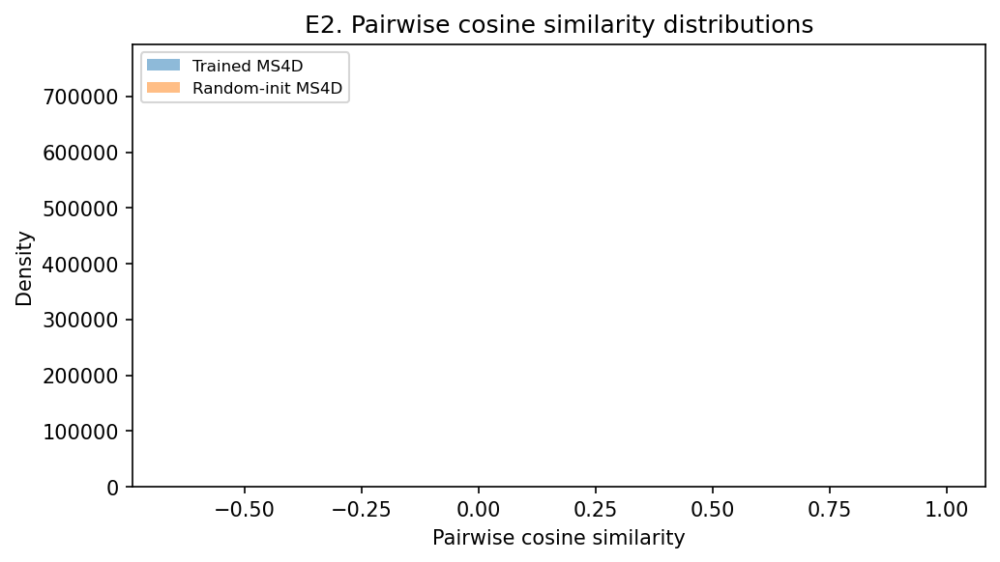

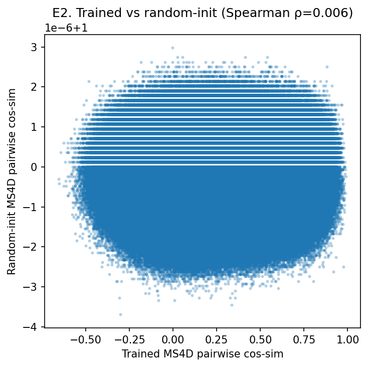

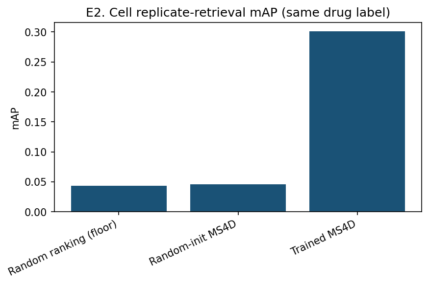

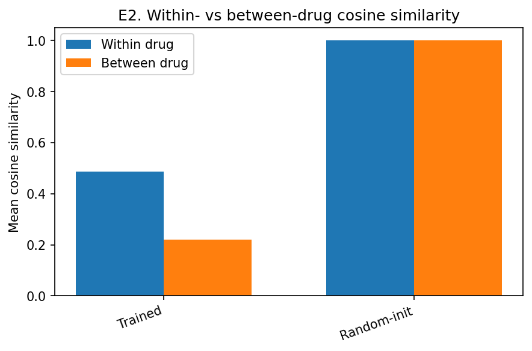

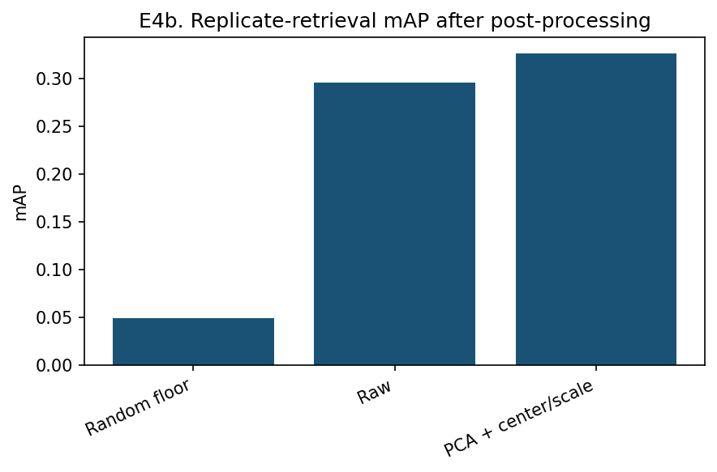

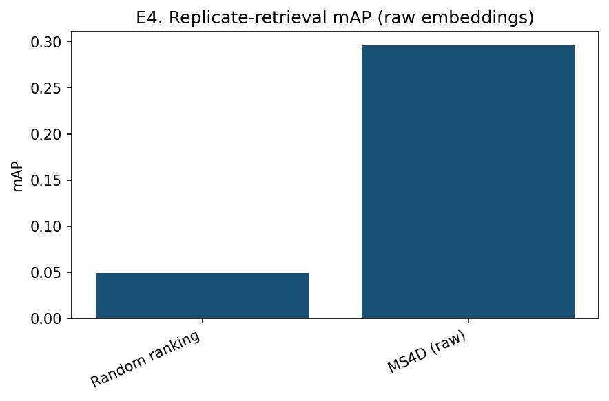

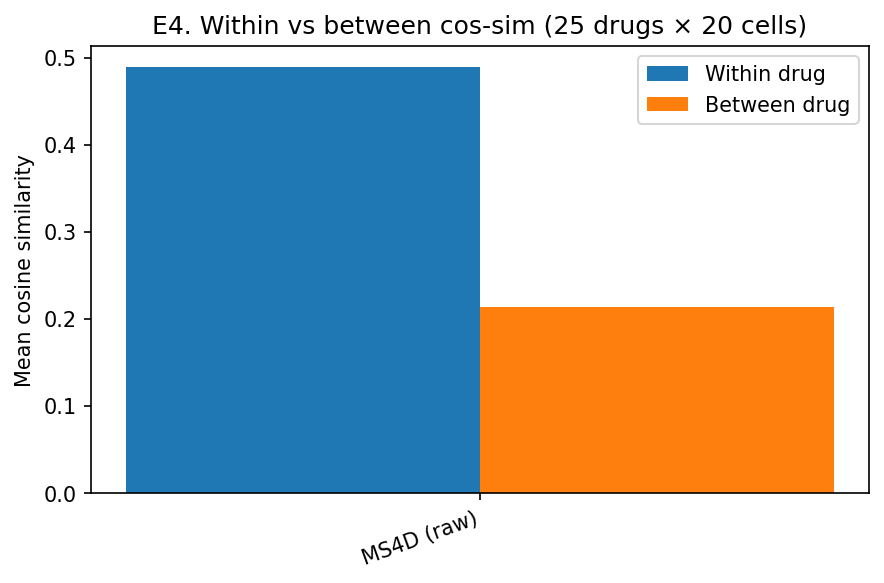

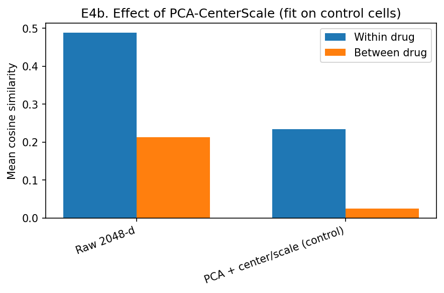

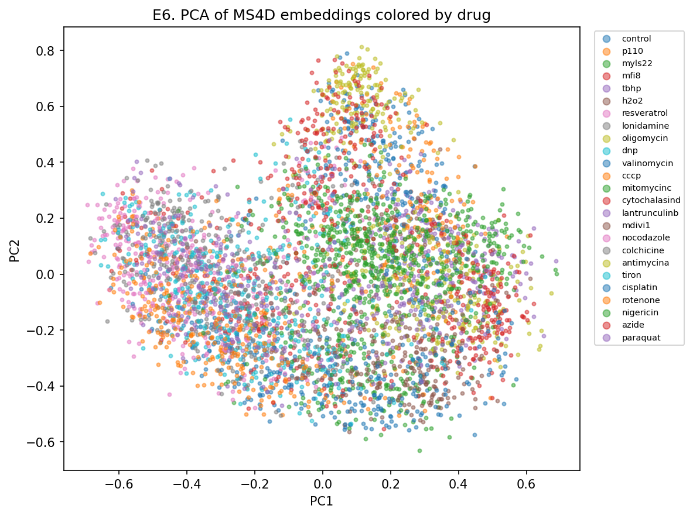

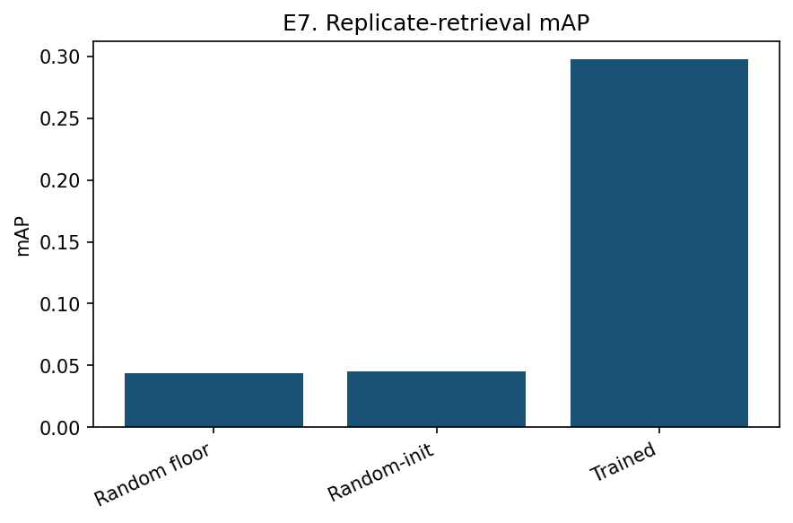

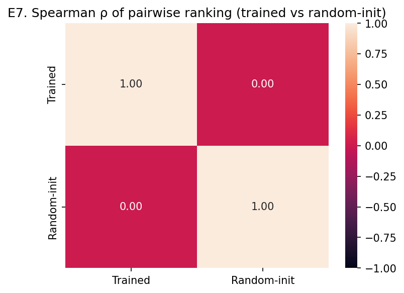

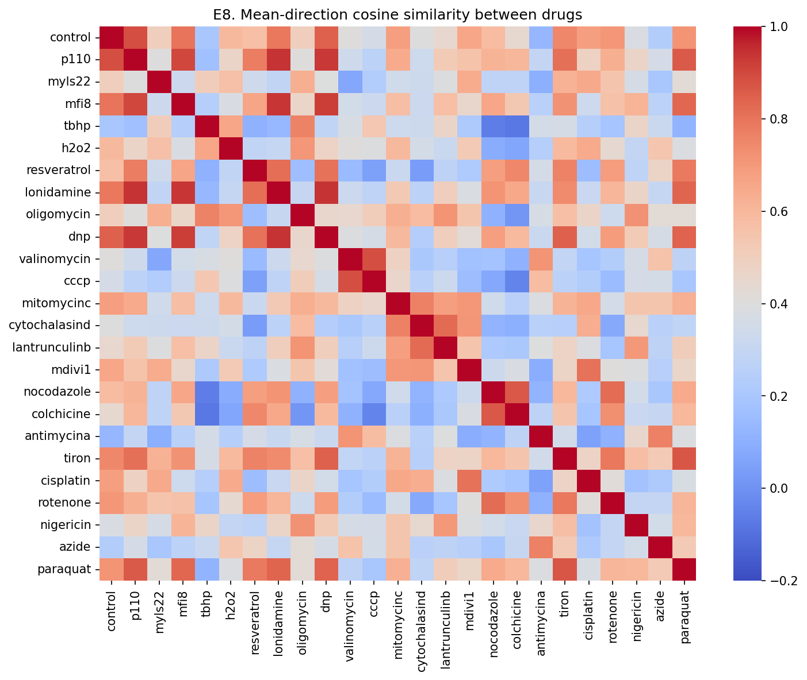


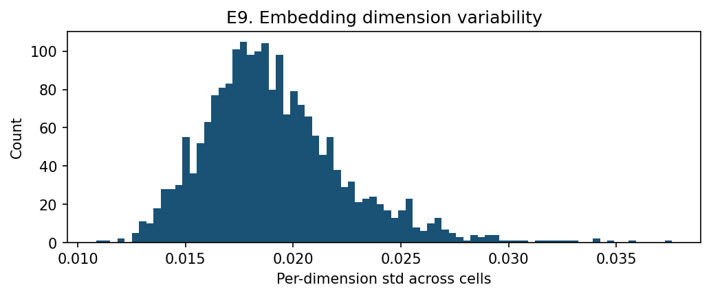
